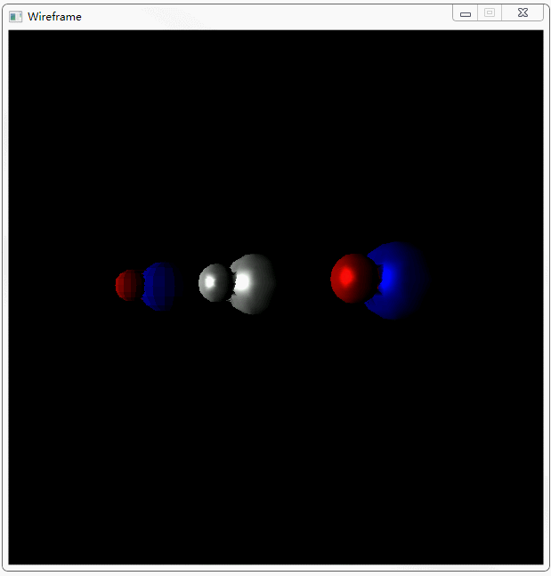

本项目是一个基于windows gdi的软件光栅化渲染器，不调用第三方库，只调用gdi的填充屏幕像素的函数，类似于只调用屏幕绘制的drawPixel(x, y , rbg)，目的在于深入了解渲染管线。

目前进度：
实现基本的坐标变换和Phong着色，包括漫反射和镜面反射。效果如下：

待完成：
背面剪裁、剔除、阴影、贴图等。

本项目参考资料：

1. [《3D游戏编程大师技巧》](https://book.douban.com/subject/1321769/)
2. [想用C++实现一个软件渲染器，类似DX和OpenGL，除了《3D游戏编程大师技巧》，或者什么网站推荐？ - 韦易笑的回答 - 知乎](https://www.zhihu.com/question/33712299/answer/58495947)